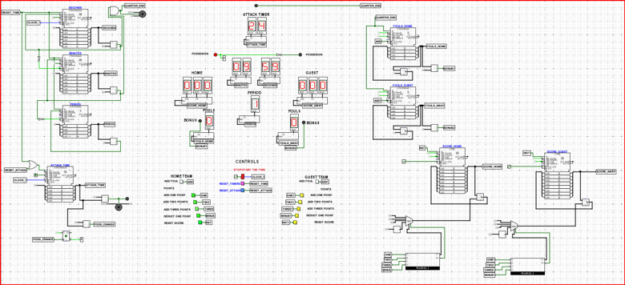
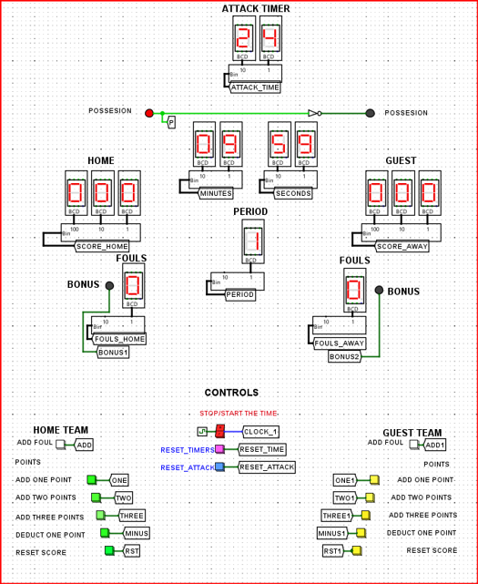
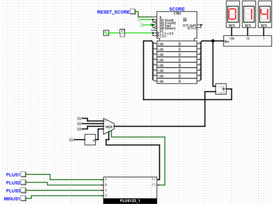
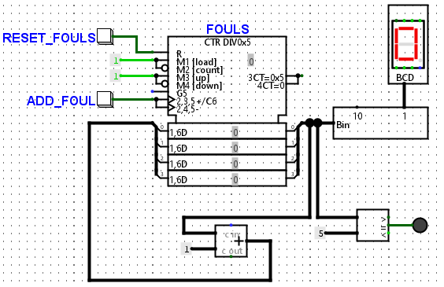
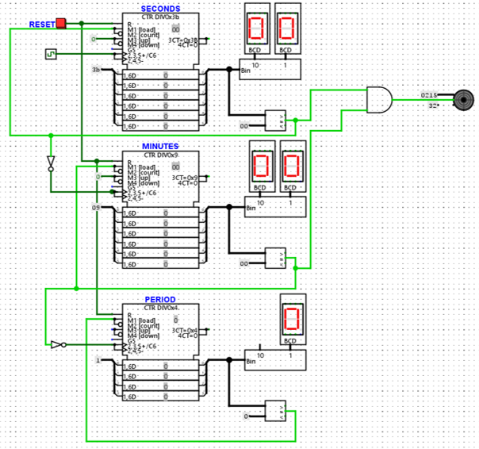
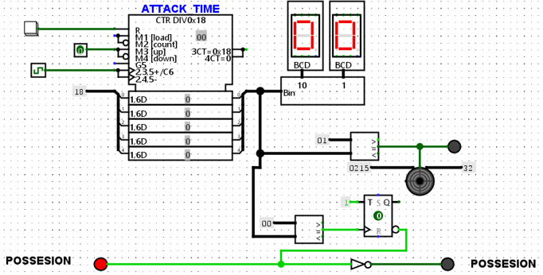

# Basketball Scoreboard Simulation

A digital basketball scoreboard simulation developed individually using **Logisim Evolution** as a practical implementation of digital logic design principles. The project reproduces the core functionality of a basketball scoreboard, including score tracking, foul management, game timing, period management, shot clock control, buzzer alerts, and possession indication.

## Overview

The objective of this project was to design and simulate a functional basketball scoreboard using digital logic circuits.

The system combines multiple digital logic components into an integrated scoreboard capable of responding to user input and displaying game information in real time. The implementation demonstrates the practical application of **combinational and sequential logic**, counters, multiplexers, adders, comparators, flip-flops, and seven-segment displays.

The final design is organized to resemble a physical basketball scoreboard, with separate controls for the Home and Guest teams and centralized controls for game timing.

## Features

### Score Management

The scoreboard provides independent score tracking for the Home and Guest teams.

* Add 1, 2, or 3 points
* Subtract 1 point to correct scoring errors
* Reset each team's score independently
* Real-time score display
* Binary-to-BCD and BCD-to-seven-segment conversion
* Multiplexer-based selection of scoring operations

### Foul Management

Each team has an independent foul counter.

* Increment team fouls
* Reset foul count
* Automatic detection of five fouls
* Bonus indicator LED
* Comparator-based foul-limit detection

When a team's foul count reaches five, the corresponding LED is activated to indicate the bonus state.

### Game Timer

The game timer simulates a **10-minute basketball period**.

* Minute and second countdown
* Period counter
* Start/stop functionality
* Timer reset
* Automatic period progression
* End-of-period detection
* Buzzer notification
* Seven-segment displays for time and period

### Shot Clock

The system includes a **24-second shot clock**.

* 24-second countdown
* Dedicated reset button
* Warning LED when 1 second remains
* Buzzer warning
* Possession change when the timer reaches zero
* Possession control implemented using a T Flip-Flop

## System Architecture

```text
                       BASKETBALL SCOREBOARD
                                │
              ┌─────────────────┼─────────────────┐
              │                 │                 │
              ▼                 ▼                 ▼
       ┌──────────────┐  ┌──────────────┐  ┌──────────────┐
       │ Score System │  │ Foul System  │  │ Game Timer   │
       │ Home / Guest │  │ Home / Guest │  │ 10 min /     │
       └──────────────┘  └──────────────┘  │ Period       │
                                           └──────┬───────┘
                                                  │
                                                  ▼
                                           ┌──────────────┐
                                           │ Shot Clock   │
                                           │   24 sec     │
                                           └──────────────┘
```

Each subsystem was designed independently and then integrated into the final scoreboard circuit.

## Digital Logic Implementation

### Score Counters

Two independent counters are used to track the scores of the Home and Guest teams.

The user can select between four scoring operations:

| Selection | Operation |
| :-------: | --------- |
|    `00`   | +1 point  |
|    `01`   | +2 points |
|    `10`   | +3 points |
|    `11`   | -1 point  |

The selected value is passed through a multiplexer and combined with the current score using an adder.

A custom `PLUS123_1` circuit controls the multiplexer selection. It receives the scoring button signals and produces the corresponding selection signals and multiplexer enable signal.

A negator is used to generate the negative value required for the `-1` score correction.

The resulting binary value is converted to BCD and subsequently to the format required by the seven-segment displays.

### Foul Counters

The foul management system consists of two independent counters, one for each team.

Each foul button increments the corresponding counter by one. An adder combines the current counter value with a constant value of one.

A comparator continuously checks whether the foul count has reached five. When the value is equal to five, the corresponding bonus LED is activated.

### Game Timer

The game timer is implemented using separate counters for:

* Minutes
* Seconds
* Periods

The seconds counter operates based on the clock signal. When the seconds counter reaches zero, the minutes counter is updated. When both minutes and seconds reach zero, the period counter advances.

Two comparator outputs are combined using an AND gate to detect when the period has ended. This condition activates the buzzer.

The timer can be started, stopped, and reset through dedicated controls on the main interface.

### Shot Clock

The shot clock implements a 24-second countdown.

When the shot clock reaches one second, a warning LED and buzzer are activated. When the counter reaches zero, the possession indicator changes state.

The possession mechanism is implemented using a **T Flip-Flop** together with a NOT gate, allowing the possession state to alternate between the two teams.

## Interface Design

The final circuit is arranged to resemble a physical basketball scoreboard.

The main scoreboard display is positioned at the center of the design, while the control interfaces are located below it.

The control layout is divided into:

### Home Team Controls

* Add 1 point
* Add 2 points
* Add 3 points
* Subtract 1 point
* Add foul
* Reset score

### Guest Team Controls

* Add 1 point
* Add 2 points
* Add 3 points
* Subtract 1 point
* Add foul
* Reset score

### Game Controls

* Start/stop game timer
* Reset game timer
* Reset shot clock

Tunnels are used throughout the circuit to organize signal connections and reduce unnecessary wiring. This improves readability and keeps the overall circuit structure clean and maintainable.

## Components Used

The following digital logic components are used throughout the project:

* Counters
* Adders
* Multiplexers
* Comparators
* Negators
* AND gates
* NOT gates
* T Flip-Flop
* Binary-to-BCD converters
* BCD-to-seven-segment converters
* Seven-segment displays
* LEDs
* Push buttons
* Clock signals
* Buzzers
* Tunnels

## Screenshots

The following screenshots showcase the main components and the final implementation of the basketball scoreboard simulation.

### Complete Scoreboard

The complete Logisim Evolution circuit, including the scoreboard display, team controls, game timer controls, and shot clock controls.



### Scoreboard Display

A close-up view of the scoreboard interface displaying the current game information, including scores, fouls, game time, period, shot clock, and possession.



### Point Counter

The point counter subsystem responsible for managing scoring operations. The circuit supports adding 1, 2, or 3 points and subtracting 1 point for score correction.



### Foul Counter

The foul counter subsystem used to track fouls for each team and detect when the five-foul limit is reached.



### Game Timer

The timer subsystem implementing the ten-minute countdown, period management, and end-of-period buzzer.



### Shot Clock

The 24-second shot clock subsystem, including the warning indicator, buzzer, and possession-change mechanism.



## Results

The completed simulation successfully implements the intended functionality of a basketball scoreboard.

Testing confirmed the correct operation of:

* Home and Guest score tracking
* 1-, 2-, and 3-point scoring
* Score correction
* Independent team foul counters
* Five-foul bonus indication
* Ten-minute game timer
* Period management
* End-of-period buzzer
* 24-second shot clock
* Shot-clock warning
* Possession switching
* Individual subsystem reset controls

The integrated system provides an interactive representation of the primary functions required for basketball scorekeeping while demonstrating how fundamental digital logic components can be combined into a larger practical system.

## Technologies

### Software

* **Logisim Evolution**

### Digital Logic Concepts

* Combinational Logic
* Sequential Logic
* Counters
* Multiplexers
* Adders
* Comparators
* Flip-Flops
* Digital Displays
* Clock-Based Timing

## Project Structure

```text
basketball-scoreboard-logisim/
│
├── BasketballScoreboard.circ
├── README.md
│
└── screenshots/
    ├── FoulsCounter.png
    ├── FullView.png
    ├── PointCounter.png
    ├── ScoreboardCloseUp.png
    ├── ShotClock.png
    └── Timer.png
```

### Files

**`BasketballScoreboard.circ`**
The complete Logisim Evolution circuit containing the basketball scoreboard implementation and all of its subsystems.

**`screenshots/`**
Contains screenshots of the completed circuit and its individual components.

**`README.md`**
Project documentation, implementation overview, and visual documentation.

## Getting Started

### Prerequisites

* **Logisim Evolution**

### Running the Simulation

1. Clone the repository:

```bash
git clone https://github.com/bjukovic/basketball-scoreboard-logisim.git
```

2. Navigate to the project directory:

```bash
cd basketball-scoreboard-logisim
```

3. Open `BasketballScoreboard.circ` in Logisim Evolution.
4. Start the circuit simulation.
5. Use the control buttons to operate the scoreboard.

## Project Objectives

The primary objectives of this project were to:

1. Design and implement a functional digital basketball scoreboard.
2. Apply digital logic concepts to a practical real-world application.
3. Implement independent scoring and foul-management systems.
4. Develop clock-based countdown and period-management circuits.
5. Implement a 24-second shot clock with possession control.
6. Integrate multiple digital subsystems into a single functional circuit.
7. Design an organized and understandable circuit architecture.
8. Demonstrate the interaction between combinational and sequential logic.

## Educational Value

This project demonstrates how individual digital logic components can be combined to create a complete interactive system.

Through the implementation, the project provided practical experience with:

* Digital circuit design
* Combinational and sequential logic
* Counter design
* Arithmetic operations
* Multiplexer-based input selection
* Comparator-based control
* Flip-Flop state management
* Clock-driven systems
* Seven-segment display control
* Modular circuit organization

## Academic Context

|                             |                    |
| --------------------------- | ------------------ |
| **Course**                  | Digital Design     |
| **Semester**                | Fall 2024          |
| **Project Type**            | Individual Project |
| **Development Environment** | Logisim Evolution  |

This project was developed as a practical application of **Digital Design**, combining theoretical concepts with the implementation of a functional sports-management system.

The basketball scoreboard provides a concrete example of how digital logic can be applied to a real-world system requiring timing, counting, state management, user input, and visual output.

## Author

**Berina Juković**

Computer Science & Engineering
